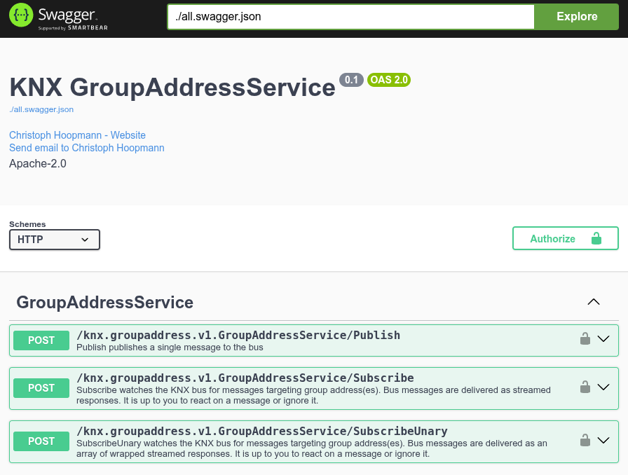

# knxrpc

[](https://pkg.go.dev/github.com/choopm/knxrpc)
[](https://github.com/choopm/knxrpc/actions/workflows/release.yml)
[](https://github.com/choopm/knxrpc/actions/workflows/unittest.yml)

## Documentation

### Description

knxrpc provides a [ConnectRPC](https://github.com/connectrpc/connect-go)
handler and server for RPCs interacting with a KNX bus in smart homes.

You can either integrate it as a `http.Handler` in your own code or
run the included server which has swagger and metrics support.

You can find the protobuf-spec in [groupaddressservice.proto](knx/groupaddress/v1/groupaddressservice.proto).

You can access Swagger UI (if enabled via config) via: <http://localhost:8080/swagger>.



### knxrpc API client using golang

You can use the generated golang code and helper funcs to build your own API client.

Take this as an example:

```golang
package main

import (
    "github.com/choopm/knxrpc"
    v1 "github.com/choopm/knxrpc/knx/groupaddress/v1"

    "github.com/vapourismo/knx-go/knx/dpt"
    // ...
)

func main() {
    // build ctx
    ctx, cancel := context.WithTimeout(context.Background(), time.Second() * 3)
    defer cancel()

    // construct knxrpc client
    client, err := knxrpc.NewClient(knxrpc.ClientConfig{
        Host: "127.0.0.1",
        Port: 8080,
    })
    if err != nil {
        panic(fmt.Errorf("knxrpc: %s", err))
    }

    // publish a message
    _, err := client.Publish(ctx, connect.NewRequest(&v1.PublishRequest{
        GroupAddress: "1/2/3",
        Data:         dpt.DPT_1002(true).Pack(),
        Event:        v1.Event_EVENT_WRITE,
    }))
    if err != nil {
        panic(fmt.Errorf("unable to send: %s", err))
    }

    // connect stream to receive bus messages for specific group addresses
    stream, err := client.Subscribe(ctx, connect.NewRequest(&v1.SubscribeRequest{
        GroupAddresses: []string{"1/2/3", "4/5/6"},
        Event:          v1.Event_EVENT_UNSPECIFIED,
    }))
    if err != nil {
        panic(fmt.Errorf("stream open: %s", err))
    }
    defer stream.Close()

    // start receiver loop
    for stream.Receive() {
        res := stream.Msg()
        // TODO handle res message here
        fmt.Println(res.GroupAddress)
        fmt.Println(res.Event)
        fmt.Println(res.Data)
        // ...
    }
    if connectErr := new(connect.Error); errors.As(err, &connectErr) &&
        !errors.Is(connectErr, context.Canceled) &&
        !errors.Is(connectErr, context.DeadlineExceeded) {
        panic(fmt.Errorf("stream closed: %s", stream.Err()))
    }
}
```

### knxrpc binary - server mode

Starting the container will run the `knxrpc` binary in server mode using the argument `server`.

This will provide a ConnectRPC server to handle the RPCs defined at
[groupaddressservice.proto](knx/groupaddress/v1/groupaddressservice.proto).

You *will* have to configure your KNX gatewayHost and port in the YAML config.
You can also override the defaults using environment variables whiceh are derived
from the YAML path such as:

- `KNXRPC_KNX_GATWAYHOST=192.168.1.2`
- `KNXRPC_RPC_AUTH_ENABLED=true`
- `KNXRPC_RPC_AUTH_SECRETKEY=password`

> Note the prefix `KNXRPC` when setting environment variables from YAML paths.

If enabled and configured in [knxrpc.yaml](cmd/knxrpc/knxrpc.yaml), you will be
able to use the SwaggerUI for testing RPCs.

When deploying to public or production, make sure to use TLS and authorization
as otherwise you would be allowing public access to the KNX bus.

### knxrpc binary - client publish/subscribe

You can also run the subcommands `subscribe` or `publish` to directly
interact with any running RPC server.

This is useful when you are already running a knxrpc server.
The client commands will use the `knxrpc:` section from YAML for connecting to
the knxrpc server.

#### publishing

```shell
# send the data '\x01' (hex string) to group address 0/4/0
/usr/bin/knxrpc publish 0/4/0 01

# send the hex-string of 'hello world' to group address 1/2/3
/usr/bin/knxrpc publish 1/2/3 68656c6c6f20776f726c64

# send a read request
/usr/bin/knxrpc publish 0/5/6

# send a response message
/usr/bin/knxrpc publish --event response 0/5/6 fffd
```

#### subscribing

```shell
# subscribe to all bus messages by not providing a filter
/usr/bin/knxrpc subscribe

# subscribe to all response messages (which are send as a result to previous read requests)
/usr/bin/knxrpc subscribe --event response

# subscribe to specific group address(es)
/usr/bin/knxrpc subscribe 0/5/6 0/4/0 1/2/3
```

### JSON client

#### Publishing a write event

This example sends BASE64-encoded hex data `\x01` to the groupAddress `0/5/6`.

```shell
curl -X 'POST' \
  'http://localhost:8080/knx.groupaddress.v1.GroupAddressService/Publish' \
  -H 'accept: application/json' \
  -H 'Authorization: Bearer CHANGEME' \
  -H 'Content-Type: application/json' \
  -d '{
  "groupAddress": "0/5/6",
  "event": "EVENT_WRITE",
  "data": "AQo="
}'
```

#### Publishing a read event

In this example a read-event is send to the groupAddress `0/5/6` which will
trigger an asynchronous response to be read using the Subscribe-API.

```shell
curl -X 'POST' \
  'http://localhost:8080/knx.groupaddress.v1.GroupAddressService/Publish' \
  -H 'accept: application/json' \
  -H 'Authorization: Bearer CHANGEME' \
  -H 'Content-Type: application/json' \
  -d '{
  "groupAddress": "0/5/6",
  "event": "EVENT_READ"
}'
```

#### Subscribing with JSON clients

*Subscription is implemented as a streming RPC and therefore an actual ConnectRPC client is required.*

If you really require to use a JSON client for receiving messages, you might use
wrapped SubscribeUnary API. Which internally creates the subscription stream and
collects all event message for a duration of `for`.

```shell
# receive any messages on the bus for 10s
curl -X 'POST' \
  'http://localhost:8080/knx.groupaddress.v1.GroupAddressService/SubscribeUnary' \
  -H 'accept: application/json' \
  -H 'Authorization: Bearer CHANGEME' \
  -H 'Content-Type: application/json' \
  -d '{
  "subscribeRequest": {
    "groupAddresses": [],
    "event": "EVENT_UNSPECIFIED"
  },
  "for": "10s"
}'
```

If you omit the value of `for`, the first event message received will terminate
the stream and your client will see the result immediately.

```shell
# receive the first message on the bus (missing for)
curl -X 'POST' \
  'http://localhost:8080/knx.groupaddress.v1.GroupAddressService/SubscribeUnary' \
  -H 'accept: application/json' \
  -H 'Authorization: Bearer CHANGEME' \
  -H 'Content-Type: application/json' \
  -d '{
  "subscribeRequest": {
    "groupAddresses": []
  }
}'
```

## Development

### Dev container

Open this project in Visual Studio Code and select to reopen it inside a dev container.

*If you experience any issues, make sure your IDE supports dev containers:
<https://code.visualstudio.com/docs/devcontainers/containers>*

### Tasks

This project uses [task](https://taskfile.dev/).

Run `task --list` to list all available tasks.
